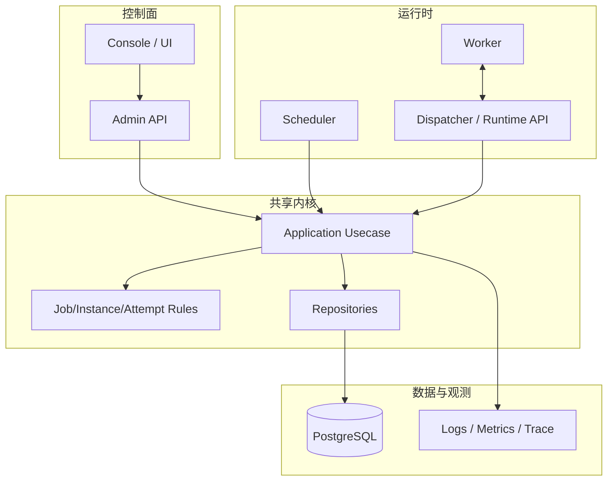

# orbitjob

current process
```text
orbitjob                        
├─ cmd                          
│  └─ admin-api                 
│     ├─ main.go                
│     └─ main_test.go           
├─ db                           
│  └─ migrations                
│     └─ 0001_init.sql          
├─ docs                         
├─ internal                     
│  ├─ application               
│  │  └─ jobapp                 
│  │     ├─ create_job.go       
│  │     ├─ create_job_test.go  
│  │     ├─ list_jobs.go        
│  │     └─ list_jobs_test.go   
│  ├─ config                    
│  │  ├─ env.go                 
│  │  └─ env_test.go            
│  ├─ job                       
│  │  ├─ errors.go              
│  │  ├─ job_list.go            
│  │  ├─ job_list_test.go       
│  │  ├─ model.go               
│  │  ├─ normalize_job.go       
│  │  └─ normalize_job_test.go  
│  ├─ store                     
│  │  └─ postgres               
│  │     ├─ db.go               
│  │     ├─ db_test.go          
│  │     ├─ job_repo.go         
│  │     ├─ job_repo_test.go    
│  │     └─ testmain_test.go    
│  └─ transport                 
│     └─ http                   
│        ├─ handler.go          
│        ├─ handler_test.go     
│        ├─ request.go          
│        └─ request_test.go     
├─ go.mod                       
├─ go.sum                       
├─ LICENSE                      
└─ README.md                    

```


在写了在写了

后续整个项目也许会围绕下面这几个模块推进


