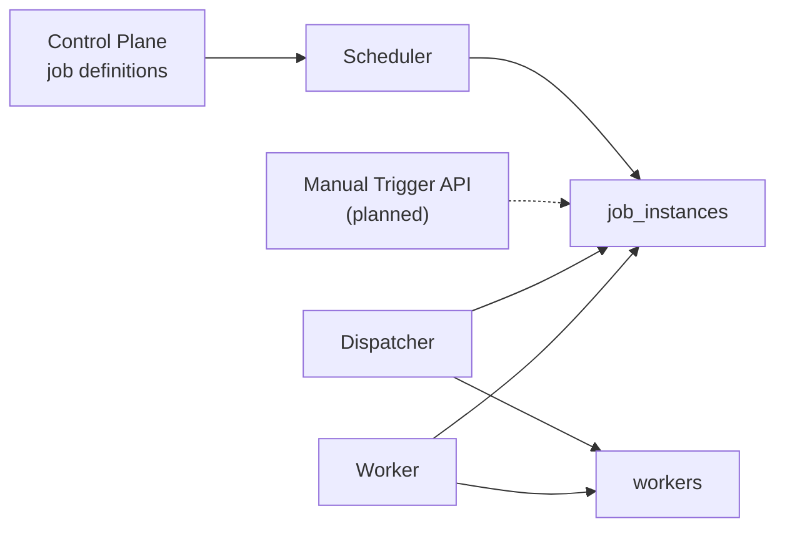
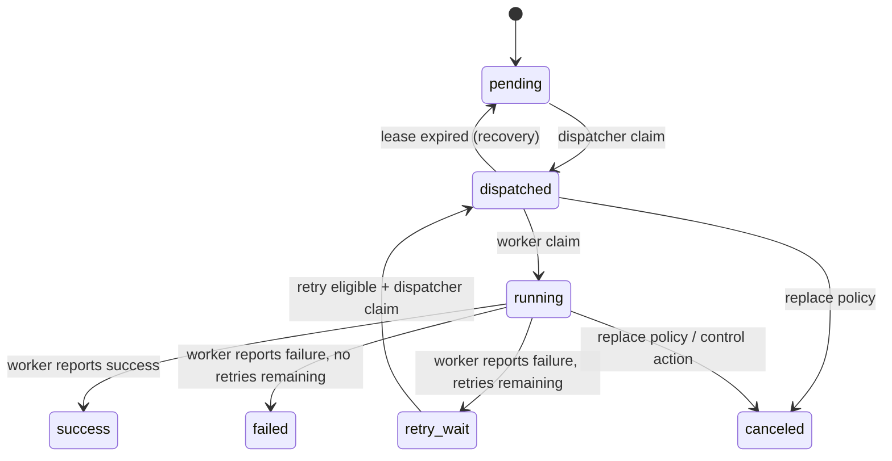

# Execution Plane Contract

[Back to README](../README.en.md)

This document defines the data model, state semantics, and behavioral contracts for the OrbitJob execution plane, providing a deterministic specification for collaboration between the scheduler, dispatcher, and worker components.

> Authoritative source: Project architecture document · Last updated 2026-05-05

## Current Implementation Status (2026-05-05)

**Implemented:**

- Execution routing fields on job definitions (`priority`, `partition_key`, `handler_type`, `handler_payload`) wired end-to-end
- `job_instances` create and claim semantics with domain model, repository, and tests
- `workers` heartbeat and lease upsert with domain model, repository, and tests
- Scheduler MVP tick loop + misfire strategies + atomic scheduling transaction
- Dispatcher runtime: atomic claim + concurrency policy + priority aging + lease recovery + graceful shutdown
- **Worker**: capacity-driven concurrent execution (goroutine pool) + four-phase graceful shutdown + self-check (GetByID/draining) + full audit trail (claim/lease/complete) + `job_instance_attempts` persistence + Prometheus metrics
- `job_instances` version column (optimistic locking)

**Not yet implemented:**

- Manual trigger API
- Instance query API
- Label-based routing / Worker heartbeat reaper (methods ready, pending dispatcher integration)

## Component Boundaries



## Job Definition Routing Fields

| Field | Purpose |
| --- | --- |
| `priority` | Base priority used by the dispatcher to order runnable instances; higher values take precedence |
| `partition_key` | Logical shard key for worker routing, queue partitioning, or tenant isolation |
| `handler_type` | Executor type identifier (e.g., `http`, `exec`) |
| `handler_payload` | Handler-specific configuration interpreted and executed by the worker |

## Job Instance State Machine



## State Semantics

| State | Meaning |
| --- | --- |
| `pending` | Created and waiting for dispatcher claim |
| `dispatched` | Claimed by dispatcher with `worker_id` and `lease_expires_at` assigned; awaiting worker pickup |
| `running` | Worker has started execution |
| `retry_wait` | Previous attempt finished with retries remaining; waits until `retry_at` to re-enter the dispatch queue |
| `success` | Terminal -- execution succeeded |
| `failed` | Terminal -- execution failed with no retries remaining |
| `canceled` | Terminal -- canceled by replace policy, control action, or recovery action |

## Dispatcher Claim Flow

Each dispatcher tick executes a bounded batch in two phases:

### Phase 1: Lease Expiry Recovery

Before normal dispatch begins, the dispatcher reclaims all instances where `status = 'dispatched'` and `lease_expires_at < now()`, resetting them to `pending` and clearing `worker_id` and `lease_expires_at`. This ensures that tasks are not lost when a dispatcher crashes after claiming.

### Phase 2: Per-Instance Dispatch

For each candidate instance, a single database transaction performs the following steps:

1. **Lock candidate**: Select one instance from `job_instances` ordered by priority, using `FOR UPDATE SKIP LOCKED` to prevent concurrent claims
2. **Lock job row**: Acquire a `FOR UPDATE` lock on the corresponding `jobs` row and read `concurrency_policy`
3. **Count running**: Query the number of `dispatched` + `running` instances for that job
4. **Policy decision**: Call the pure function `DecideDispatch(input)` to obtain a decision
5. **Execute decision**: Carry out the dispatch / skip / replace action

### Candidate Ordering and Priority Aging

Candidate instances are selected in the following order:

```
effective_priority DESC, scheduled_at ASC, id ASC
```

Effective priority is calculated as:

```
effective_priority = min(base_priority + floor(minutes_since_scheduled), base_priority + 60)
```

A pending instance gains +1 effective priority for each minute it has been waiting, capped at base priority + 60. This mechanism prevents low-priority tasks from starving indefinitely.

### Candidate States

| Candidate Condition | Rule |
| --- | --- |
| `pending` | Directly eligible |
| `retry_wait` | Must satisfy `retry_at <= now()` and `attempt < max_attempt` |

### Claim Writes

| Operation | Description |
| --- | --- |
| Normal claim | Sets `status = 'dispatched'`, writes `worker_id` and `lease_expires_at` |
| Claim from `retry_wait` | Additionally increments `attempt` and clears `retry_at`, `started_at`, `finished_at`, `result_code`, `error_msg` |

## Concurrency Policy Decision

After claiming a candidate instance but before writing the dispatched status, the dispatcher evaluates the job's `concurrency_policy` field:

| Policy | Condition | Decision |
| --- | --- | --- |
| `allow` | Any | dispatch -- permits multiple instances to run concurrently |
| `forbid` | `running_count = 0` | dispatch |
| `forbid` | `running_count > 0` | skip -- candidate remains pending for the next tick |
| `replace` | `running_count = 0` | dispatch |
| `replace` | `running_count > 0` | replace -- cancel existing dispatched/running instances, then dispatch the new one |
| Unknown | Any | falls back to allow behavior |

The decision logic is implemented as the pure function `DecideDispatch`, free of side effects and straightforward to test in isolation.

## Worker Heartbeat / Lease Rules

Workers use a single upsert operation for both initial registration and heartbeat refresh:

| Field | Rule |
| --- | --- |
| `worker_id` | Stable worker identifier, unique within a tenant |
| `status` | `online`, `offline`, or `draining` |
| `capacity` | Concurrent processing capacity; must be `>= 1` |
| `labels` | JSON object for routing and scheduling filters |
| `lease_expires_at` | Explicit lease deadline supplied by the worker during heartbeat |

Constraints:

- Heartbeat refreshes `last_heartbeat_at`
- `(tenant_id, worker_id)` is handled with upsert semantics
- A `draining` worker may continue to heartbeat; whether the dispatcher assigns new work is governed by scheduling policy

### Worker Execution Model

Workers use a capacity-driven concurrent execution model:

1. **Claim**: `ClaimNextDispatched(limit=N)` atomically claims up to N `dispatched` instances (`FOR UPDATE SKIP LOCKED`), writes an audit event per claimed instance
2. **Execute**: Each claimed task runs in its own goroutine (handler execution + lease renewal + completion), tracked by the `ExecutionsActive` gauge
3. **Complete**: Writes back result/status → INSERTs immutable `job_instance_attempts` record → INSERTs audit event
4. **Lease renew**: Extends lease every `leaseDuration/3` during execution; failures are recorded in metrics and logs

### Graceful Shutdown (Four Phases)

| Phase | Behavior |
|------|----------|
| 1. Stop claim | Context cancellation → no more `ClaimNextDispatched` calls |
| 2. Wait handlers | `RunOnce` internal `wg.Wait()` for all goroutines |
| 3. Draining | Heartbeat sends `StatusDraining` |
| 4. Offline | Main loop exits → heartbeat sends `StatusOffline` → DB closed |

## Retry Boundaries

- The `job_instance_attempts` table is active: each `CompleteInstance` writes an immutable attempt record
- When re-claiming from `retry_wait`, the attempt counter is atomically incremented at the SQL layer

## Code Locations

| Path | Purpose |
| --- | --- |
| `cmd/worker/main.go` | Worker process entry point, config loading, runLoop + heartbeatLoop |
| `cmd/dispatcher/main.go` | Dispatcher process entry point, configuration loading, and tick loop |
| `cmd/scheduler/main.go` | Scheduler process entry point |
| `internal/core/app/execute/tick.go` | Worker execution use case: concurrent claim → execute → complete |
| `internal/core/app/dispatch/tick.go` | Dispatcher tick use case: lease recovery + bounded batch |
| `internal/core/app/schedule/` | Scheduler tick use case and misfire policies |
| `internal/core/domain/instance/dispatch.go` | `DecideDispatch` pure function and concurrency policy decision |
| `internal/core/store/postgres/executor_repository.go` | Worker data plane: claim/complete/lease + audit + attempts |
| `internal/core/store/postgres/dispatch_repository.go` | Dispatch transactions + lease/worker recovery |
| `internal/platform/metrics/execution.go` | Execution metrics (ExecutionsTotal/Active, LeaseExtensionFailures) |

## Follow-up Work

- Manual trigger API
- Instance query API
- Label-based routing (`WorkerRepository.ListByLabels` + task-to-worker matching)
- Worker heartbeat reaper integration into dispatcher tick (`RecoverExpiredWorkers` ready, pending integration)
