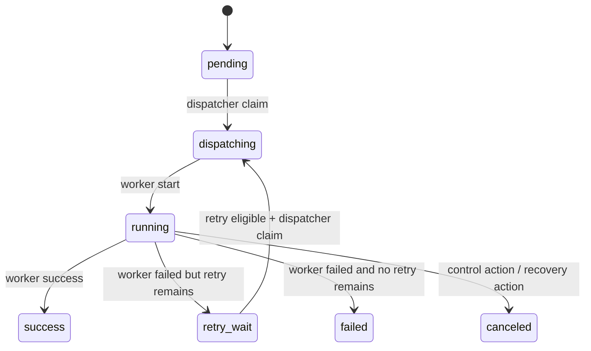

# Execution Plane Contract

[Back to README](../README.en.md)

This document defines the first execution-plane contract for OrbitJob. It exists to constrain future `scheduler`, `dispatcher`, and `worker` implementations around the data model and lifecycle semantics without requiring a full runtime loop in this phase.

## Current Implementation Status (2026-04-19)

Implemented (foundation):

- `priority` and `partition_key` are wired through the job definition code path
- `job_instances` create / claim-next-runnable have domain + repository + tests
- `workers` heartbeat / lease upsert has domain + repository + tests
- scheduler MVP tick loop landed (`cmd/scheduler` + `core/app/schedule` + `SchedulerRepository`)
- deterministic misfire policy evaluator (skip / fire_now / catch_up)
- atomic scheduling transaction (claim + insert instance + update cursor in one tx)

Not implemented yet (runtime):

- dispatcher process
- worker executor and completion write-back loop
- full scheduler-dispatcher-worker runtime closure

## Scope

This phase only standardizes:

- execution-routing fields on `job definitions`
- create and claim semantics for `job_instances`
- register / heartbeat / lease semantics for `workers`

This phase does **not** include:

- a complete worker runtime
- background coordinators for timeout recovery, lease recovery, or drain orchestration

## Component Boundaries

## Job Definition Routing Fields

| Field | Purpose |
| --- | --- |
| `priority` | dispatcher ordering for runnable instances; higher value wins |
| `partition_key` | logical shard key for future worker routing, queue partitioning, or isolation |
| `handler_type` | executor category such as `http` or `worker` |
| `handler_payload` | handler-specific configuration interpreted by the worker side |

## Job Instance State Machine

## State Semantics

| State | Meaning |
| --- | --- |
| `pending` | created and waiting for dispatcher claim |
| `dispatching` | claimed by dispatcher; `worker_id` and `lease_expires_at` assigned |
| `running` | worker has started execution |
| `retry_wait` | previous attempt finished; waits until `retry_at` becomes eligible |
| `success` | terminal success |
| `failed` | terminal failure with no retries left |
| `canceled` | terminal cancel state |

## Dispatcher Claim Rules

When dispatcher claims the next runnable instance:

| Item | Rule |
| --- | --- |
| Candidate states | `pending`, or `retry_wait` where `retry_at <= now()` and `attempt < max_attempt` |
| Ordering | `priority DESC, scheduled_at ASC, id ASC` |
| Concurrency | use `FOR UPDATE SKIP LOCKED` to avoid duplicate claims |
| Claim result | write `status='dispatching'`, `worker_id`, and `lease_expires_at` |
| Retry claim | when claiming from `retry_wait`, increment `attempt` and clear `retry_at`, `started_at`, `finished_at`, `result_code`, and `error_msg` |

## Worker Heartbeat / Lease Rules

Workers use one upsert operation for both initial registration and heartbeat refresh:

| Field | Rule |
| --- | --- |
| `worker_id` | stable worker identifier, unique inside a tenant |
| `status` | `online`, `offline`, or `draining` |
| `capacity` | must be `>= 1` |
| `labels` | JSON object for future routing and scheduling filters |
| `lease_expires_at` | explicit lease deadline supplied by the worker |

Additional constraints:

- heartbeat refreshes `last_heartbeat_at`
- `(tenant_id, worker_id)` is handled with upsert
- a `draining` worker may still heartbeat; future dispatcher policy decides whether it keeps receiving work

## Concurrency and Retry Boundaries

- `jobs.concurrency_policy` remains a job-definition rule that future dispatcher logic must consult before claim
- this phase only adds persistence foundations and does not implement the full `allow / forbid / replace` behavior
- `job_instance_attempts` remains reserved for an immutable per-attempt trail and is not fully wired in this phase

## Done Criteria For This Phase

- `priority` and `partition_key` are exposed through the job definition code path
- the system can create `job_instances`
- dispatcher can claim the next runnable instance with deterministic ordering
- workers can upsert heartbeat and lease state

## Follow-up Work

- dispatcher / worker main path (claim → execute → result write-back)
- production-hardening and observability stabilization for scheduler MVP
- lease-expiry recovery and reassignment
- manual trigger API and instance query API
