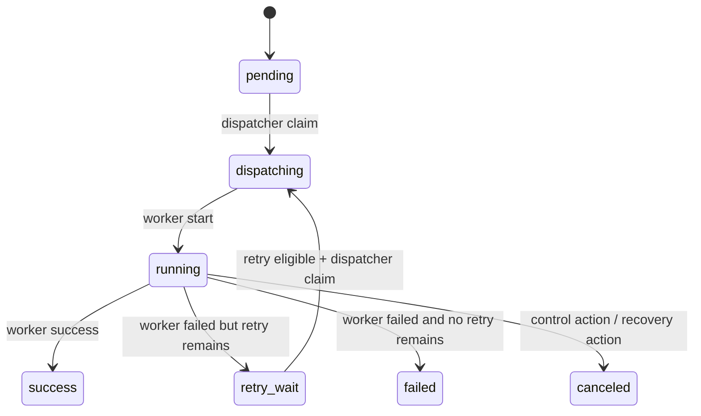

# Execution Plane 契约

[返回 README](../README.md)

本文档定义 OrbitJob execution plane 的第一阶段契约，用于约束后续 `scheduler`、`dispatcher`、`worker` 的实现边界。本文档关注数据面与状态语义，不要求本阶段实现完整 runtime loop。

## 当前实现状态（2026-04-19）

已实现（foundation）：

- `priority` / `partition_key` 已打通到 job definition 代码路径
- `job_instances` create / claim-next-runnable 已有 domain + repository + tests
- `workers` heartbeat / lease upsert 已有 domain + repository + tests
- scheduler MVP：`cmd/scheduler` + `core/app/schedule` + `SchedulerRepository.ScheduleOneDueCron`

未实现（runtime）：

- dispatcher 进程
- worker 执行器与完成回写闭环
- scheduler 与 dispatcher/worker 的完整联动闭环

## 范围

本阶段只收口以下能力：

- `job definition` 中与执行路由相关的字段
- `job_instances` 的创建与 claim 语义
- `workers` 的注册 / heartbeat / lease 语义

本阶段**不**包含：

- 完整 scheduler 扫描循环
- 完整 worker 执行器
- 超时回收、失联重试、drain 编排的后台协调器

## 组件边界

## Job Definition 路由字段

| 字段 | 作用 |
| --- | --- |
| `priority` | dispatcher 选取 runnable instance 时的优先级，越大越优先 |
| `partition_key` | 逻辑分片键，用于后续 worker 路由、队列分区或租户隔离 |
| `handler_type` | 执行器类型，例如 `http` / `worker` |
| `handler_payload` | 具体 handler 配置，worker 侧按 `handler_type` 解释 |

## Job Instance 状态机

## 状态语义

| 状态 | 含义 |
| --- | --- |
| `pending` | 已生成但尚未被 dispatcher claim |
| `dispatching` | dispatcher 已选中并写入 `worker_id` / `lease_expires_at`，等待 worker 接手 |
| `running` | worker 已开始执行 |
| `retry_wait` | 上一次 attempt 已结束，等待 `retry_at` 到达后重新进入 dispatch |
| `success` | 终态，执行成功 |
| `failed` | 终态，执行失败且无剩余重试 |
| `canceled` | 终态，被控制动作或恢复动作取消 |

## Dispatcher Claim 规则

dispatcher claim runnable instance 时遵循以下规则：

| 项目 | 规则 |
| --- | --- |
| 候选状态 | `pending`，或 `retry_wait` 且 `retry_at <= now()` 且 `attempt < max_attempt` |
| 排序 | `priority DESC, scheduled_at ASC, id ASC` |
| 并发控制 | 使用 `FOR UPDATE SKIP LOCKED` 避免重复 claim |
| claim 结果 | 写入 `status='dispatching'`、`worker_id`、`lease_expires_at` |
| retry claim | 从 `retry_wait` claim 时，`attempt = attempt + 1`，并清空 `retry_at`、`started_at`、`finished_at`、`result_code`、`error_msg` |

## Worker Heartbeat / Lease 规则

worker 通过单次 upsert 完成注册或 heartbeat：

| 字段 | 规则 |
| --- | --- |
| `worker_id` | worker 稳定标识，tenant 内唯一 |
| `status` | `online` / `offline` / `draining` |
| `capacity` | `>= 1` |
| `labels` | JSON object，供后续路由与调度过滤使用 |
| `lease_expires_at` | heartbeat 时显式提供的新租约截止时间 |

约束：

- heartbeat 会刷新 `last_heartbeat_at`
- 同一 `(tenant_id, worker_id)` 采用 upsert
- `draining` worker 仍可保留心跳，但后续 dispatcher 是否继续分配由未来调度策略决定

## Concurrency 与 Retry 边界

- `jobs.concurrency_policy` 仍属于 job definition 规则，未来 dispatcher 在 claim 前必须参考它
- 本阶段只落持久化基础，不在代码中实现完整 `allow / forbid / replace` 行为
- `job_instance_attempts` 保留为后续每次执行 attempt 的不可变 trail，本阶段不要求完整写入链路

## 本阶段的完成标准

- `priority` / `partition_key` 从 job definition schema 拉通到代码层
- 可以创建 `job_instances`
- dispatcher 可以按既定排序 claim runnable instance
- worker 可以 upsert 自身 heartbeat 和 lease

## 后续工作

- scheduler 在生产配置下稳定运行与观测收敛
- worker start / finish / retry / timeout 的完整 repository 动作
- 过期 lease 的回收与重分配
- manual trigger API 与 instance query API
