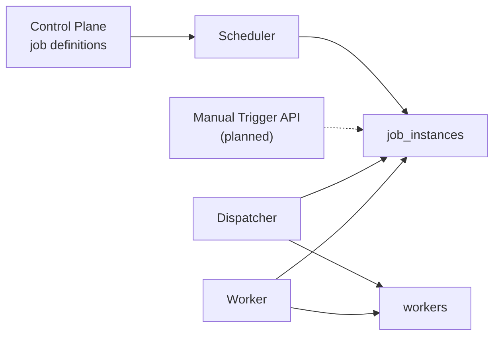
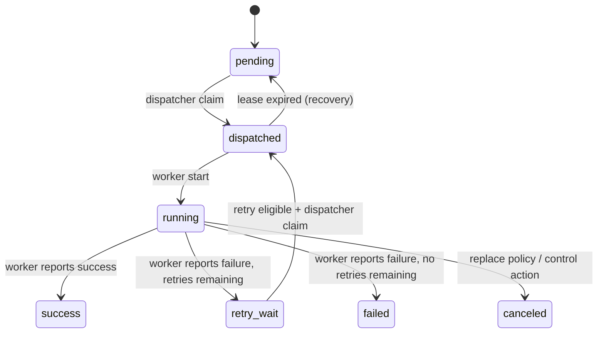

# Execution Plane 契约

[返回 README](../README.md)

本文档定义 OrbitJob execution plane 的数据模型、状态语义与组件行为契约，为 scheduler、dispatcher、worker 之间的协作提供确定性规范。

> 权威来源：项目架构文档 · 更新时间 2026-05-05

## 当前实现状态（2026-05-05）

**已实现：**

- Job definition 中与执行路由相关的字段全链路打通
- `job_instances` 的 create 与 claim 语义已落地
- `workers` 的 heartbeat 与 lease upsert 已落地
- Scheduler MVP tick loop + misfire 策略 + 原子调度事务
- Dispatcher runtime：原子 claim + concurrency policy + priority aging + lease recovery + graceful shutdown
- **Worker**：并发执行模型（capacity-driven goroutine pool）+ 四阶段优雅关闭 + 自检（GetByID/draining）+ audit 全链路（claim/lease/complete）+ `job_instance_attempts` 持久化 + Prometheus metrics
- `job_instances` version 列（乐观锁）

**未实现：**

- Manual trigger API
- Instance query API
- 标签路由 / Worker 心跳回收（方法已就绪，待 dispatcher 调用）

## 组件边界



## Job Definition 路由字段

| 字段 | 作用 |
| --- | --- |
| `priority` | 基础优先级，dispatcher 选取 runnable instance 时作为排序依据，值越大优先级越高 |
| `partition_key` | 逻辑分片键，用于 worker 路由、队列分区或租户隔离 |
| `handler_type` | 执行器类型标识（如 `http` / `worker`） |
| `handler_payload` | 具体 handler 配置，worker 侧按 `handler_type` 解释并执行 |

## Job Instance 状态机



## 状态语义

| 状态 | 含义 |
| --- | --- |
| `pending` | 已创建，等待 dispatcher claim |
| `dispatched` | dispatcher 已 claim 并分配 `worker_id` 与 `lease_expires_at`，等待 worker 接手执行 |
| `running` | worker 已开始执行 |
| `retry_wait` | 上一次 attempt 已结束且仍有剩余重试次数，等待 `retry_at` 到达后重新进入 dispatch 队列 |
| `success` | 终态 -- 执行成功 |
| `failed` | 终态 -- 执行失败且无剩余重试 |
| `canceled` | 终态 -- 被 replace policy 取消或由控制动作 / 恢复动作取消 |

## Dispatcher Claim 流程

Dispatcher 每轮 tick 执行一个 bounded batch，流程分为两个阶段：

### 阶段一：Lease Expiry Recovery

在开始正常 dispatch 之前，先回收所有 `status = 'dispatched'` 且 `lease_expires_at < now()` 的孤儿 instance，将其重置为 `pending`，清除 `worker_id` 和 `lease_expires_at`。这确保了 dispatcher 崩溃后不会丢失任务。

### 阶段二：逐条 Dispatch

对每条候选 instance，在单个数据库事务内依次完成：

1. **锁定候选**：从 `job_instances` 中按优先级排序选取一条，使用 `FOR UPDATE SKIP LOCKED` 防止并发 claim
2. **锁定 job 行**：对对应 `jobs` 行加 `FOR UPDATE` 锁，读取 `concurrency_policy`
3. **统计运行数**：查询该 job 当前 `dispatched` + `running` 状态的 instance 数量
4. **策略决策**：调用纯函数 `DecideDispatch(input)` 获得决策结果
5. **执行决策**：根据结果执行 dispatch / skip / replace

### 候选排序与 Priority Aging

候选 instance 的选取排序为：

```
effective_priority DESC, scheduled_at ASC, id ASC
```

其中 effective priority 的计算方式：

```
effective_priority = min(base_priority + floor(minutes_since_scheduled), base_priority + 60)
```

即 pending instance 每等待一分钟，有效优先级自动 +1，上限为 base priority + 60。这一机制防止低优先级任务长时间饥饿。

### 候选状态

| 候选条件 | 规则 |
| --- | --- |
| `pending` | 直接符合候选条件 |
| `retry_wait` | 需满足 `retry_at <= now()` 且 `attempt < max_attempt` |

### Claim 写入

| 操作 | 说明 |
| --- | --- |
| 正常 claim | 设置 `status = 'dispatched'`、写入 `worker_id` 和 `lease_expires_at` |
| 从 `retry_wait` claim | 在上述基础上 `attempt + 1`，清除 `retry_at`、`started_at`、`finished_at`、`result_code`、`error_msg` |

## Concurrency Policy 决策

dispatcher 在 claim 候选 instance 后、写入 dispatched 状态前，根据 job 的 `concurrency_policy` 字段执行策略决策：

| 策略 | 条件 | 决策 |
| --- | --- | --- |
| `allow` | 任何情况 | dispatch -- 允许多实例并发运行 |
| `forbid` | `running_count = 0` | dispatch |
| `forbid` | `running_count > 0` | skip -- 候选 instance 保持 pending，等待下一轮 tick |
| `replace` | `running_count = 0` | dispatch |
| `replace` | `running_count > 0` | replace -- 先取消现有 dispatched/running instance，再 dispatch 新实例 |
| 未知策略 | 任何情况 | 降级为 allow 行为 |

决策逻辑实现为纯函数 `DecideDispatch`，无副作用，便于独立测试。

## Worker Heartbeat / Lease 规则

Worker 通过单次 upsert 操作同时完成注册与心跳刷新：

| 字段 | 规则 |
| --- | --- |
| `worker_id` | worker 的稳定标识，在 tenant 内唯一 |
| `status` | `online` / `offline` / `draining` |
| `capacity` | 并发处理能力，必须 `>= 1` |
| `labels` | JSON object，供路由与调度过滤使用 |
| `lease_expires_at` | heartbeat 时由 worker 显式提供的新租约截止时间 |

约束：

- heartbeat 刷新 `last_heartbeat_at`
- 同一 `(tenant_id, worker_id)` 采用 upsert 语义
- `draining` 状态的 worker 仍可维持心跳，dispatcher 是否继续分配由调度策略决定

### Worker 执行模型

Worker 采用 capacity-driven 并发执行：

1. **Claim**：`ClaimNextDispatched(limit=N)` 原子 claim N 个 `dispatched` instance，写入 audit event
2. **Execute**：每个 task 在独立 goroutine 中执行（handler + lease renewal + complete）
3. **Complete**：写回 status → INSERT `job_instance_attempts` → INSERT audit event
4. **Lease renew**：执行期间每 `leaseDuration/3` 续期，失败时记录 metrics + 日志

### 优雅关闭（四阶段）

| 阶段 | 行为 |
|------|------|
| 1. 停止 claim | context 取消 → 不再调用 ClaimNextDispatched |
| 2. 等待 handler | RunOnce 内 `wg.Wait()` 等待所有 goroutine |
| 3. Draining | heartbeat 发送 `StatusDraining` |
| 4. Offline | 主循环关闭后发送 `StatusOffline`，关闭 DB |

## Retry 边界

- `job_instance_attempts` 表已启用：每次 `CompleteInstance` 写入不可变 attempt 记录
- 从 `retry_wait` 重新 claim 时，attempt 计数器在 SQL 层原子递增

## 代码位置

| 路径 | 作用 |
| --- | --- |
| `cmd/worker/main.go` | Worker 进程入口、配置加载、runLoop + heartbeatLoop |
| `cmd/dispatcher/main.go` | Dispatcher 进程入口、配置加载与 tick loop |
| `cmd/scheduler/main.go` | Scheduler 进程入口 |
| `internal/core/app/execute/tick.go` | Worker 执行用例：并发 claim → execute → complete |
| `internal/core/app/dispatch/tick.go` | Dispatcher tick 用例：lease recovery + bounded batch |
| `internal/core/app/schedule/` | Scheduler tick 用例与 misfire 策略 |
| `internal/core/domain/instance/dispatch.go` | `DecideDispatch` 纯函数与 concurrency policy 决策 |
| `internal/core/store/postgres/executor_repository.go` | Worker 数据面：claim/complete/lease + audit + attempts |
| `internal/core/store/postgres/dispatch_repository.go` | Dispatch 事务 + lease/worker recovery |
| `internal/platform/metrics/execution.go` | 执行 metrics（ExecutionsTotal/Active, LeaseExtensionFailures） |

## 后续工作

- Manual trigger API
- Instance query API
- 标签路由（`WorkerRepository.ListByLabels` + task-to-worker matching）
- Worker 心跳回收集成到 dispatcher tick（`RecoverExpiredWorkers` 已就绪）
