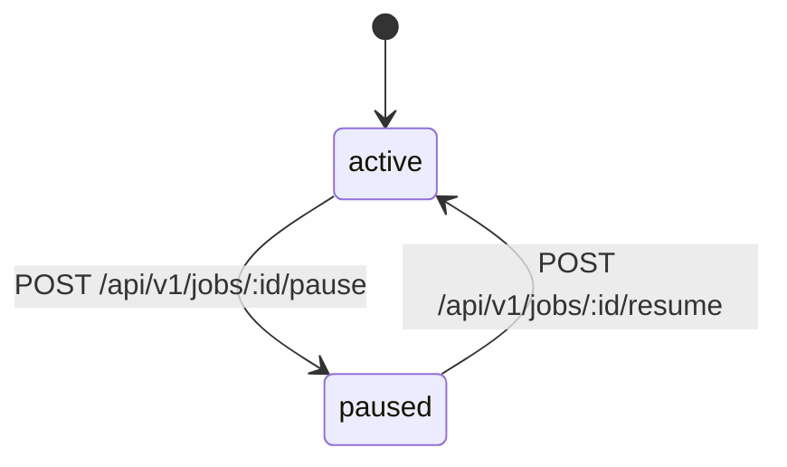

# Job Lifecycle

[Back to README](../README.en.md)

This document describes the state model for job definitions in the OrbitJob control plane, the allowed state transitions, and the corresponding HTTP endpoint contracts.

## Current Implementation Status (2026-04-20)

- `pause` and `resume` are fully wired through the HTTP handler, application command, and repository layers
- State changes use optimistic locking (`jobs.version`) for concurrency control, with audit rows written in the same transaction
- `delete` is not part of the current lifecycle scope

## State Diagram

## State Definitions

| State | Meaning |
| --- | --- |
| `active` | The job definition is enabled; the scheduler includes it in scheduling evaluation |
| `paused` | The job definition is suspended; its data is retained but the scheduler will not generate new instances for it |

## Allowed Transitions

| Current State | Action | Target State | HTTP Endpoint |
| --- | --- | --- | --- |
| `active` | pause | `paused` | `POST /api/v1/jobs/:id/pause` |
| `paused` | resume | `active` | `POST /api/v1/jobs/:id/resume` |

Attempting an operation on a job that is already in the target state is an invalid transition and is rejected at the domain layer.

## HTTP Endpoint Contract

### Request Specification

| Item | Rule |
| --- | --- |
| Path parameter | `:id` must be an integer `>= 1` |
| Query parameter | `tenant_id` (optional), maximum 64 characters |
| Request body | `version` is required and must be `>= 1`, used for optimistic locking |
| Header | `X-Actor-ID` is required to identify the actor for audit logging |

### Response Specification

| Scenario | HTTP Status | Description |
| --- | --- | --- |
| Successful operation | `200` | Returns the latest job definition snapshot |
| Request binding or field validation failure | `400` | Malformed request or field constraint violation |
| Resource not found | `404` | No job exists with the specified id, or it has been soft-deleted |
| Version conflict | `409` | The `version` in the request does not match the current database value |
| Invalid state transition | `409` | The job is already in the target state |
| Unexpected error | `500` | Internal error |

## Concurrency Control

State changes use optimistic locking:

1. The client includes the currently known `version` in the request body
2. The server uses `WHERE version = $expected` as a condition in the `UPDATE` statement
3. If the update affects zero rows, the server returns `409 Conflict`
4. On successful update, `version` is automatically incremented and returned to the client for subsequent operations

## Audit

Each state change writes an audit record within the same transaction, capturing:

- Operation type (pause / resume)
- Actor (`X-Actor-ID`)
- State before and after the change
- Timestamp

## Code Locations

| Path | Purpose |
| --- | --- |
| `internal/core/domain/job/status_transition.go` | Domain-layer state transition rules |
| `internal/admin/app/job/command/pause.go` | pause and resume application commands |
| `internal/core/store/postgres/job_status.go` | State change persistence and audit record writes |
| `internal/admin/http/handler.go` | pause and resume HTTP handler entry points |
