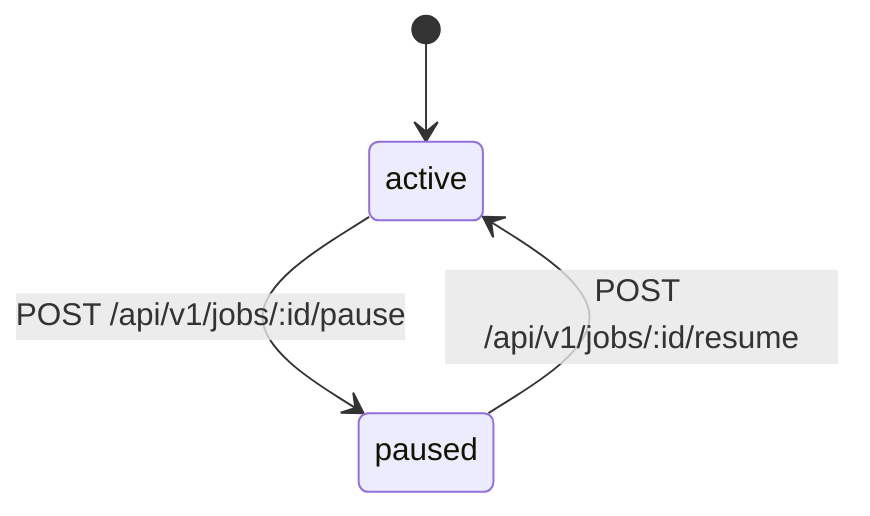

# Job Lifecycle

[Back to README](../README.en.md)

This document describes the visible job states in the current OrbitJob control plane, the allowed transitions between them, and the corresponding HTTP endpoint rules.

## State Diagram

## State Definitions

| State | Meaning |
| --- | --- |
| `active` | the job definition is enabled |
| `paused` | the job definition is retained but not enabled |

## Allowed Transitions

| Current State | Action | Target State | HTTP Endpoint |
| --- | --- | --- | --- |
| `active` | `pause` | `paused` | `POST /api/v1/jobs/:id/pause` |
| `paused` | `resume` | `active` | `POST /api/v1/jobs/:id/resume` |

## Endpoint Rules

| Item | Notes |
| --- | --- |
| Path | `:id` must be an integer `>= 1` |
| Query | `tenant_id` is optional and limited to `64` chars |
| Body | `version` is required and must be `>= 1` |
| Header | `X-Actor-ID` is required for audit logging |
| Success response | returns the latest job snapshot |
| Concurrency control | uses optimistic locking on `jobs.version` |

## Error Semantics

| Scenario | HTTP Status |
| --- | --- |
| request binding or validation failure | `400` |
| missing resource | `404` |
| version conflict | `409` |
| unexpected internal error | `500` |

## Code Locations

| Path | Purpose |
| --- | --- |
| `internal/core/domain/job/status_transition.go` | domain transition rules |
| `internal/admin/app/job/command/pause.go` | pause and resume application commands |
| `internal/core/store/postgres/job_status.go` | persisted state changes and audit writes |
| `internal/admin/http/handler.go` | `pause` and `resume` HTTP entrypoints |
