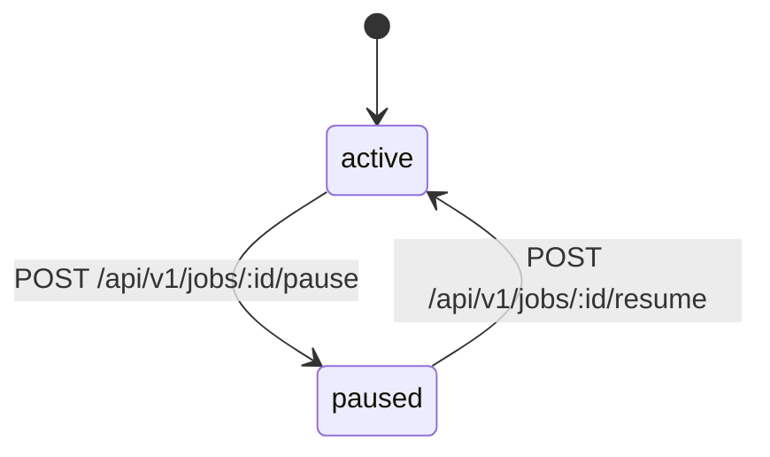

# Job 生命周期

[返回 README](../README.md)

本文档描述 OrbitJob 当前 control plane 中 job 的可见状态、允许的状态变更，以及对应的 HTTP 接口约束。

## 当前实现状态（2026-04-19）

- `pause` / `resume` 接口已在 `admin/http`、`admin/app/job/command`、`core/store/postgres` 全链路落地
- 状态变更走 optimistic locking，并在同事务写入审计记录
- `delete` 不在当前生命周期范围内

## 状态图

## 状态定义

| 状态 | 含义 |
| --- | --- |
| `active` | job 已启用，可被调度平面视为可运行定义 |
| `paused` | job 已暂停，保留定义但不处于启用状态 |

## 允许的流转

| 当前状态 | 操作 | 目标状态 | HTTP 接口 |
| --- | --- | --- | --- |
| `active` | `pause` | `paused` | `POST /api/v1/jobs/:id/pause` |
| `paused` | `resume` | `active` | `POST /api/v1/jobs/:id/resume` |

## 接口约束

| 项目 | 说明 |
| --- | --- |
| Path | `:id` 必须为 `>= 1` 的整数 |
| Query | `tenant_id` 可选，最大长度 `64` |
| Body | `version` 必填，且 `>= 1` |
| Header | `X-Actor-ID` 必填，用于审计 |
| 成功响应 | 返回最新 job 快照 |
| 并发控制 | 基于 `jobs.version` 的 optimistic locking |

## 错误语义

| 场景 | HTTP 状态码 |
| --- | --- |
| 请求绑定或字段校验失败 | `400` |
| 资源不存在 | `404` |
| 版本冲突 | `409` |
| 其他未预期错误 | `500` |

## 代码位置

| 路径 | 作用 |
| --- | --- |
| `internal/core/domain/job/status_transition.go` | 领域状态流转规则 |
| `internal/admin/app/job/command/pause.go` | pause / resume 应用层命令 |
| `internal/core/store/postgres/job_status.go` | 持久化状态变更与审计 |
| `internal/admin/http/handler.go` | `pause` / `resume` HTTP 入口 |
