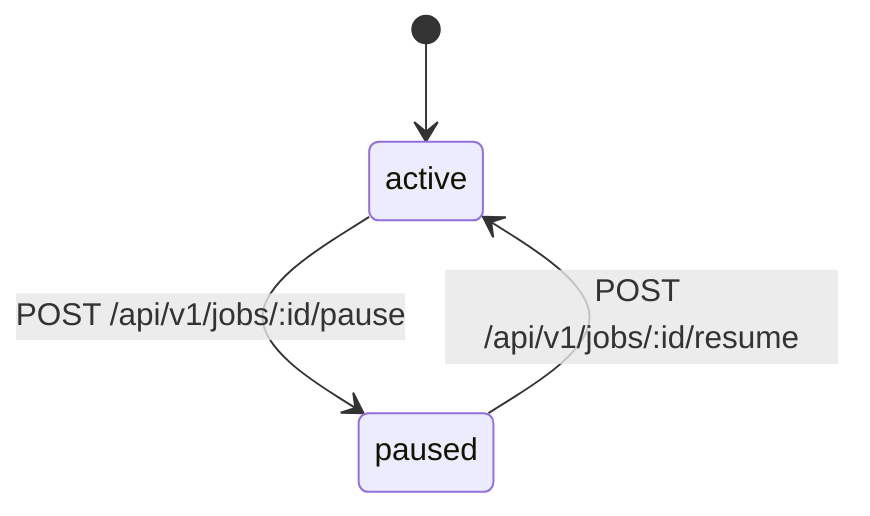

# Job 生命周期

[返回 README](../README.md)

本文档描述 OrbitJob control plane 中 job definition 的状态模型、允许的状态流转，以及对应的 HTTP 接口契约。

## 当前实现状态（2026-04-20）

- `pause` / `resume` 已在 HTTP handler、application command、repository 全链路落地
- 状态变更通过 optimistic locking（`jobs.version`）实现并发控制，审计记录在同一事务内写入
- `delete` 不在当前生命周期范围内

## 状态图

## 状态定义

| 状态 | 含义 |
| --- | --- |
| `active` | job definition 处于启用状态，scheduler 会将其纳入调度评估 |
| `paused` | job definition 已暂停，保留定义数据但 scheduler 不会为其生成新的 instance |

## 允许的状态流转

| 当前状态 | 操作 | 目标状态 | HTTP 接口 |
| --- | --- | --- | --- |
| `active` | pause | `paused` | `POST /api/v1/jobs/:id/pause` |
| `paused` | resume | `active` | `POST /api/v1/jobs/:id/resume` |

对已处于目标状态的 job 执行相同操作属于非法流转，由 domain 层拒绝。

## HTTP 接口契约

### 请求规范

| 项目 | 规则 |
| --- | --- |
| Path 参数 | `:id` 必须为 `>= 1` 的整数 |
| Query 参数 | `tenant_id`（可选），最大长度 64 字符 |
| Request Body | `version` 必填，必须 `>= 1`，用于 optimistic locking |
| Header | `X-Actor-ID` 必填，标识操作者，写入审计记录 |

### 响应规范

| 场景 | HTTP 状态码 | 说明 |
| --- | --- | --- |
| 操作成功 | `200` | 返回最新的 job definition 快照 |
| 请求绑定或字段校验失败 | `400` | 请求格式错误或字段约束不满足 |
| 资源不存在 | `404` | 指定 id 的 job 不存在或已被逻辑删除 |
| 版本冲突 | `409` | 请求中的 `version` 与数据库当前值不匹配 |
| 非法状态流转 | `409` | 对已处于目标状态的 job 执行重复操作 |
| 未预期错误 | `500` | 内部错误 |

## 并发控制

状态变更采用 optimistic locking：

1. 客户端在请求体中携带当前已知的 `version`
2. 服务端在 `UPDATE` 语句中以 `WHERE version = $expected` 作为条件
3. 若更新行数为 0，返回 `409 Conflict`
4. 成功更新后 `version` 自动递增，返回给客户端用于后续操作

## 审计

每次状态变更在同一事务内写入审计记录，包含：

- 操作类型（pause / resume）
- 操作者（`X-Actor-ID`）
- 变更前后的状态
- 时间戳

## 代码位置

| 路径 | 作用 |
| --- | --- |
| `internal/core/domain/job/status_transition.go` | 领域层状态流转规则定义 |
| `internal/admin/app/job/command/pause.go` | pause / resume application command |
| `internal/core/store/postgres/job_status.go` | 状态变更持久化与审计记录写入 |
| `internal/admin/http/handler.go` | pause / resume HTTP handler 入口 |
